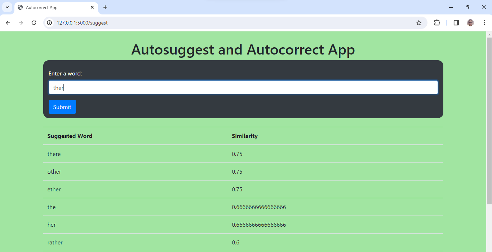

## Autosuggestion App

Welcome to the AutoSuggestion app! This application utilizes NLP concepts and the Jaccard distance algorithm to provide users with word suggestions based on similarity.

## Description

The AutoSuggestion app allows users to input a word, and the app's algorithm will generate and display the next 10 most similar words based on the Jaccard distance metric. Jaccard distance measures the dissimilarity between two sets by comparing their intersection and union, making it suitable for word similarity tasks.

A Glimpse of the App :

## Features

- **Word Suggestions** : Users can input a word, and the app will provide the next 10 most similar words based on Jaccard distance.
- **NLP Concept** : The app employs Natural Language Processing (NLP) techniques to analyze and process the input word.
- **Jaccard Distance** : The Jaccard distance algorithm is used to determine the similarity between words.
- **Web-Based Interface** : The app provides a user-friendly web interface for seamless interaction.

## Technologies Used

- Python
- Flask : Utilized as the web framework for handling user requests and responses.
- Natural Language Toolkit (NLTK)
- HTML : Used for structuring the web interface.
- CSS : Employed for styling and enhancing the visual appearance of the app.

## Run 
To run this project open termnial at that location and run command : flask run

If you have any questions or suggestions regarding this project, feel free to [contact me](mailto:mayankanand2701@gmail.com).

Happy Coding!
