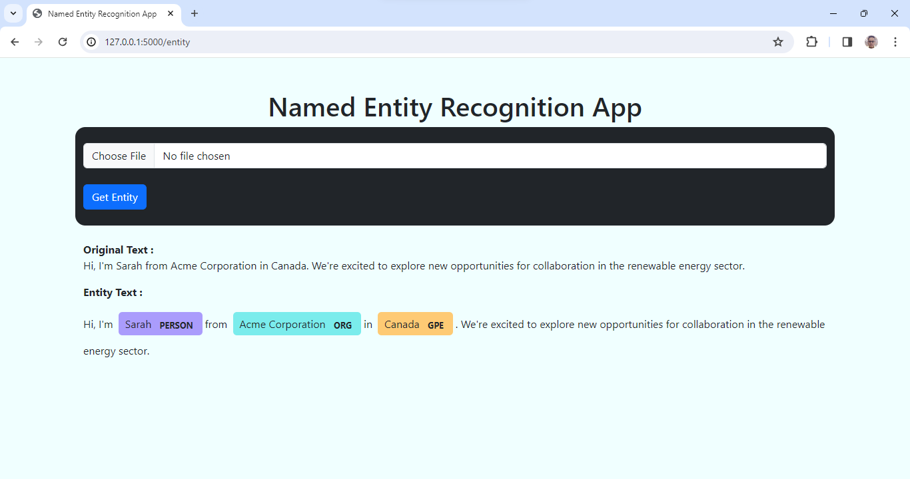

## Named Entity Recognition App

Welcome to the Named Entity Recognition (NER) App! This project is an application that utilizes Natural Language Processing (NLP) techniques to identify and classify named entities within text.

## Overview

Named Entity Recognition (NER) is a subtask of information extraction that seeks to locate and classify named entities mentioned in unstructured text into predefined categories such as the names of persons, organizations, locations, expressions of times, quantities, monetary values, percentages, etc.

A Glimpse of the App :

## Features

- **Entity Recognition**: Identify named entities such as persons, organizations, locations, etc., within the input text.
- **Classification**: Classify each identified entity into predefined categories.
- **User-friendly Interface**: Interact with the NER functionality through an intuitive web interface.
- **Scalable**: Easily extendable to support additional languages and entity types.

## Technologies Used

- Python
- Flask
- Natural Language Toolkit (NLTK)
- HTML
- CSS

## Run 
To run this project open termnial at that location and run command : flask run

If you have any questions or suggestions regarding this project, feel free to [contact me](mailto:mayankanand2701@gmail.com).

Happy Coding!
