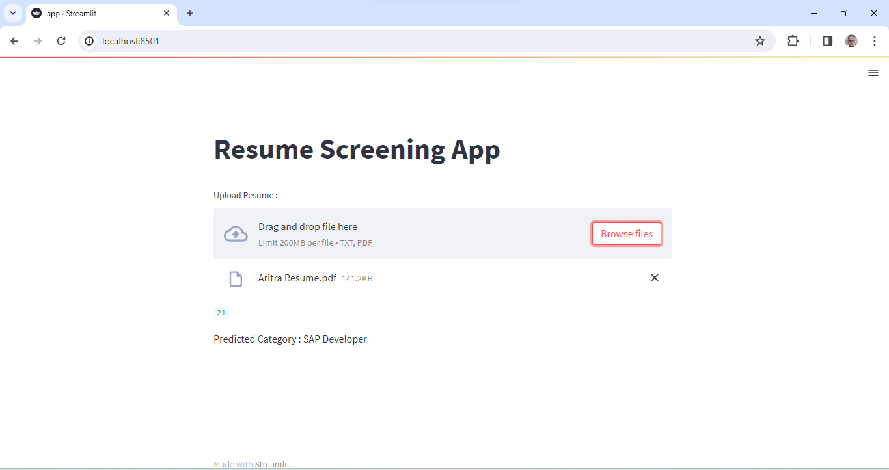

## Resume Screening App
This is a simple application developed using Streamlit and Natural Language Processing (NLP) techniques to screen resumes and predict the category of the job role based on the content of the resume.

A Glimpse of the App :

## Technologies Used :
- Streamlit : Streamlit is an open-source app framework for Machine Learning and Data Science projects. It is used here to create a user-friendly interface for uploading resumes and displaying predictions.
- Natural Language Toolkit (NLTK) : NLTK is a leading platform for building Python programs to work with human language data. It is used here for text preprocessing tasks such as tokenization and cleaning of resume text.
- Scikit-learn : Scikit-learn is a simple and efficient tool for data mining and data analysis, built on NumPy, SciPy, and matplotlib. It is used here for building and deploying the machine learning model for resume categorization.
- Python : The entire application is built using Python programming language.

## How to Run the App :
- git clone <repository_url>
- cd Resume Screening App
- streamlit run app.py
- Upload Resume : Once the app is running, you will see an option to upload a resume file (either in .txt or .pdf format). Select the file you want to analyze.
- View Prediction : After uploading the resume, the app will process the text and predict the category of the job role based on the content of the resume.

If you have any questions or suggestions regarding this project, feel free to [contact me](mailto:mayankanand2701@gmail.com).

Happy Coding!
